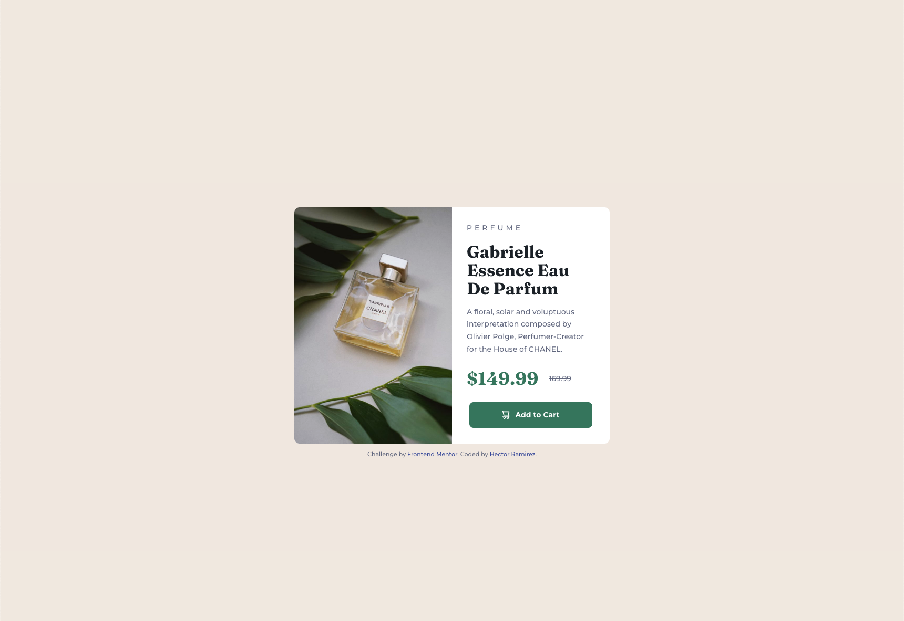

# Frontend Mentor - Product preview card component solution

This is a solution to the [Product preview card component challenge on Frontend Mentor](https://www.frontendmentor.io/challenges/product-preview-card-component-GO7UmttRfa). Frontend Mentor challenges help you improve your coding skills by building realistic projects. 

## Table of contents

- [Overview](#overview)
  - [Screenshot](#screenshot)
  - [Links](#links)
- [My process](#my-process)
  - [Built with](#built-with)
  - [What I learned](#what-i-learned)
  - [Continued development](#continued-development)
  - [Useful resources](#useful-resources)
- [Author](#author)

## Overview

### Screenshot

### Links

- Solution URL: (https://hectorlil48.github.io/product-preview-card-component/)

## My process

I feel like im getting better at writing CSS and I will continue to get more practice and learn some animations. 

### Built with

- Semantic HTML5 markup
- CSS custom properties
- Flexbox
- Mobile-first workflow

### What I learned

I learned how to only display one picture at a time when I had 2 different pictures. I got more practice with flex box.

### Continued development

I want tp get more practice using flex box to build layouts. I also liked using a moblie first approach, so I want to keep using that.

### Useful resources

- [MDN](https://developer.mozilla.org/en-US/) - Reading the docs always helps remembering what styles do what.
- [Stack Overflow](https://stackoverflow.com/) - When I have questions I always end up finding the answer here.

## Author

- Website - [Hector Ramirez](https://hectoramirez.com/)
- Frontend Mentor - [@hectorlil48](https://www.frontendmentor.io/profile/hectorlil48)
- Linkedin - [Hector Ramirez](linkedin.com/in/hector-ramirez-6a6509170)

